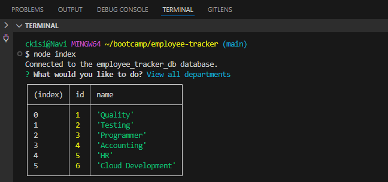
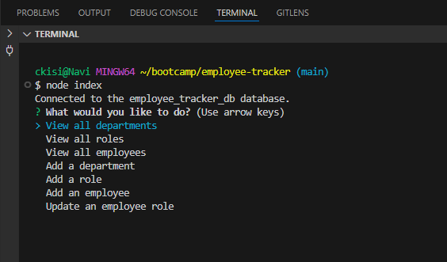

# Employee Tracker

## Description
This is an employee tracker for business owners, specifically desgined for viewing and managing departments, roles, and employees. It's purpose is to help business owners organize and plan their business. It can be used to add new employees, roles, or departments; or view the current ones in a table format. It uses primary and foreign keys to make the data connected.

## Usage
This is a CLI that is first started by running "node index". It will then give you a list of options to add or view employees, roles, or departments. You can alse update an employee role in case they change positions. When you choose to view the data, it will appear in a table for accessibility.

## Technologies
- Node.js
- Inquirer
- Dotenv

## Links
https://github.com/ckisi/employee-tracker
https://drive.google.com/file/d/1IHxzQ_A-m21ySdZWGy6oDeTtLd4U-Y1z/view

## Screenshots

## Credits
Xpert Learning Assistant
